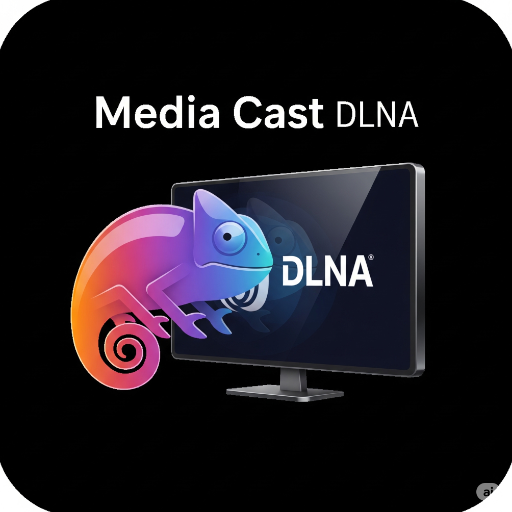
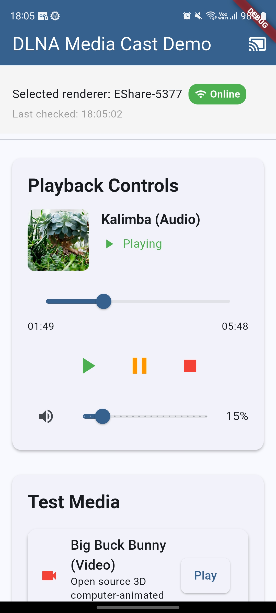
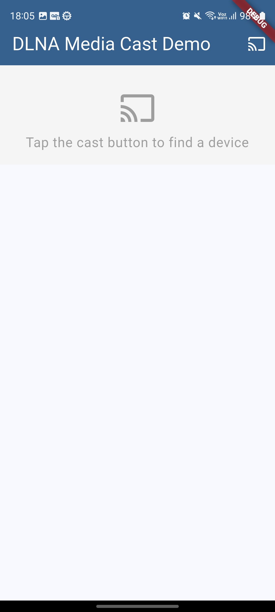
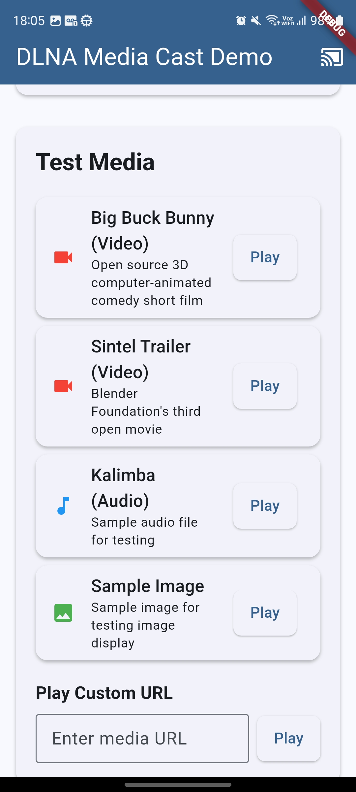

# 📺 Media Cast DLNA

<div align="center">



[](https://pub.dev/packages/media_cast_dlna)
[](https://github.com/felnanuke2/media_cast_dlna)
[](https://flutter.dev)
[](LICENSE)

**A powerful Flutter plugin for discovering and controlling DLNA/UPnP media devices on your local network (Android only)**

*Cast your media to smart TVs, speakers, and other DLNA-enabled devices with ease!*

</div>

---

## 🚨 Platform Support Notice

**Currently, this plugin supports Android only.** iOS support has been temporarily removed due to Apple's strict privacy limitations and requirements for device discovery functionality.

### Why iOS is not supported (for now):

- **Multicast Permission Restrictions**: Apple requires special entitlements for multicast networking, which is essential for DLNA device discovery
- **App Store Review Challenges**: Getting multicast permissions approved is difficult and not guaranteed
- **Privacy Limitations**: Apple's privacy framework restricts network device discovery capabilities
- **Development Complexity**: The additional overhead doesn't justify the uncertain approval process

### Future iOS Support:

We may reconsider iOS support in the future, but for now, **we recommend using AirPlay for iOS casting functionality**, which is natively supported by Apple and provides a better user experience on iOS devices.

### Alternative for iOS:

For iOS users who need casting functionality, consider:
- **AirPlay**: Built-in iOS casting solution
- **Third-party solutions**: Apps that have already obtained necessary permissions
- **Web-based approaches**: Using browser-based casting methods

---

## 📦 Installation

### Step 1: Add to pubspec.yaml

```yaml
dependencies:
  media_cast_dlna: ^0.0.1
```

### Step 2: Install the package

```bash
flutter pub get
```

### Step 3: Android Configuration

Add the following permissions to your `android/app/src/main/AndroidManifest.xml`:

```xml
<manifest xmlns:android="http://schemas.android.com/apk/res/android">
    
    <!-- Required for DLNA/UPnP network discovery and communication -->
    <uses-permission android:name="android.permission.INTERNET" />
    <uses-permission android:name="android.permission.ACCESS_NETWORK_STATE" />
    <uses-permission android:name="android.permission.ACCESS_WIFI_STATE" />
    <uses-permission android:name="android.permission.CHANGE_WIFI_MULTICAST_STATE" />
    
    <application
        android:label="@string/app_name"
        android:name="${applicationName}"
        android:icon="@mipmap/ic_launcher">
        
        <!-- Your existing activity configuration -->
        
        <!-- Required service for JUPnP Android UPnP functionality -->
        <service android:name="org.jupnp.android.AndroidUpnpServiceImpl"/>
    </application>
</manifest>
```

**Note**: Create a `strings.xml` file in `android/app/src/main/res/values/` directory:

```xml
<?xml version="1.0" encoding="utf-8"?>
<resources>
    <string name="app_name">DLNA Media Example</string>
</resources>
```

### Step 4: Import and Initialize

```dart
import 'package:media_cast_dlna/media_cast_dlna.dart';

// The main import gives you access to all classes:
// - MediaCastDlnaApi (main API class)
// - DlnaDevice, DeviceUdn, etc. (device classes)
// - VolumeLevel, TimePosition, etc. (typed wrappers)
// - VideoMetadata, AudioMetadata, etc. (metadata classes)
// - TransportState, PlaybackInfo, etc. (state classes)
// - DiscoveryOptions, SubtitleTrack, etc. (configuration classes)
```

---

## ⚠️ Device Compatibility Notice

**Important**: Not all DLNA/UPnP media renderers support every feature offered by this plugin. Device capabilities vary significantly between manufacturers and models.

### 🎬 Subtitle Support Warning

**Subtitle control methods may not work on all devices:**
- `setMediaUriWithSubtitles()` - Device-dependent subtitle embedding
- `supportsSubtitleControl()` - Always check before using subtitle features
- `setSubtitleTrack()` - Track switching support varies
- `getAvailableSubtitleTracks()` - Not all devices report available tracks

**Testing Recommendation**: We recommend testing subtitle functionality with your specific DLNA devices before releasing your app, as support varies widely between manufacturers.

### ⚡ Playback Speed Control Warning

**Playback speed control is not universally supported:**
- `setPlaybackSpeed()` - Many DLNA devices don't support variable speed playback
- Speed values like 0.5x, 1.25x, 2.0x may be ignored or cause errors
- Some devices only support play/pause/stop operations

**User Experience**: Consider implementing graceful error handling and informing users when speed control is not available on their device.

### 📋 Compatibility Testing

**Before deploying your app**, please test these features with your target devices:

1. **Test with multiple device brands** (Samsung, LG, Sony, etc.)
2. **Verify subtitle rendering** works as expected
3. **Check playback speed control** functionality
4. **Implement fallback behaviors** for unsupported features

**Feedback Welcome**: If you encounter compatibility issues or find devices that work well with these features, please share your findings in the [GitHub Issues](https://github.com/felnanuke2/media_cast_dlna/issues) to help other developers.

---

## 🚀 What is Media Cast DLNA?

Media Cast DLNA is a comprehensive Flutter plugin that transforms your app into a media casting powerhouse. Built with cutting-edge technology using the **Pigeon package** for seamless native interface generation, this plugin provides robust DLNA/UPnP functionality for discovering and controlling media devices on your local network.

### 🎯 Key Capabilities

- **🔍 Smart Device Discovery**: Automatically find DLNA/UPnP devices (TVs, speakers, media players)
- **📱 Media Renderer Control**: Full playback control with play, pause, stop, seek, volume management
- **🎬 Advanced Subtitle Support**: Handle subtitle tracks for enhanced viewing experience ⚠️ *Device-dependent*
- **⚡ Playback Speed Control**: Variable speed playback (0.5x, 1.25x, 2.0x, etc.) ⚠️ *Limited device support*
- **📊 Real-time Status Monitoring**: Get instant updates on playback state, position, and volume changes
- **🔧 Native Performance**: Powered by Pigeon-generated native interfaces for optimal performance

## 🏠 Unlocking Your Home Network: A Look at DLNA-Enabled TVs, Speakers, and Media Devices

In the interconnected home of today, the ability to seamlessly share and stream digital content is paramount. One of the key technologies facilitating this is the Digital Living Network Alliance (DLNA), a set of standards that allows compliant devices to discover, share, and play media files over a home network. For consumers, this translates to the effortless enjoyment of photos, music, and videos stored on a computer or network-attached storage (NAS) drive on a variety of entertainment devices.

Numerous manufacturers across the consumer electronics spectrum have embraced DLNA certification, ensuring a wide array of interoperable products.

### 📺 Leading the Pack: DLNA-Compatible Television Manufacturers

Many of the world's leading television manufacturers have integrated DLNA technology into their smart TVs. This enables users to easily stream their personal media libraries directly to the biggest screen in the house. Prominent brands offering DLNA-certified TVs include:

* **Samsung:** A long-time supporter of DLNA, many of Samsung's smart TVs feature robust DLNA capabilities.
* **LG:** Another major player, LG's webOS smart TVs typically come equipped with DLNA support.
* **Sony:** Sony's Bravia line of televisions has a history of DLNA integration, allowing for easy streaming from other Sony and third-party devices.
* **Panasonic:** Viera TVs from Panasonic often include DLNA functionality, fitting into a broader ecosystem of connected devices.
* **Hisense and TCL:** These rapidly growing brands also offer a range of smart TVs with DLNA support, providing more budget-friendly options for consumers.
* **Philips:** Many of Philips' smart TVs are DLNA-certified, allowing them to communicate with other compliant devices.

### 🔊 The Sound of Connectivity: DLNA in the Audio Realm

The convenience of DLNA extends beyond visual media, with a growing number of speaker and audio device manufacturers incorporating the standard. This allows for the creation of multi-room audio systems and easy streaming of high-fidelity music files. Key players in this space include:

* **Bose:** Known for its premium audio products, Bose offers a selection of smart speakers and soundbars with DLNA compatibility.
* **Sonos:** While primarily known for its proprietary wireless mesh network, many Sonos products also support DLNA for broader compatibility.
* **Denon and Marantz:** These sister companies, renowned for their AV receivers and audio components, widely support DLNA across their product lines.
* **Yamaha:** A major name in both musical instruments and home audio, Yamaha's MusicCast system and other networked audio products frequently feature DLNA.
* **Harman Kardon:** This brand offers a range of speakers and audio systems that include DLNA as a connectivity option.
* **Bluesound:** Focused on high-resolution audio, Bluesound's wireless speakers and components are DLNA-certified, catering to audiophiles.

### 🎮 The Hubs of Your Media: DLNA-Enabled Media Renderers and Servers

Beyond the end-point devices like TVs and speakers, a crucial part of the DLNA ecosystem is the "media renderer" and "media server." A media renderer is a device that can play content it receives from a media server. While many smart TVs and speakers act as renderers, dedicated devices also exist.

**Media Servers** are the backbone of a DLNA setup, storing and serving the media files. These can be:

* **Computers:** Both Windows and macOS have built-in DLNA server capabilities (often referred to as media streaming).
* **Network-Attached Storage (NAS) Drives:** Brands like **Synology**, **QNAP**, and **Western Digital** offer NAS devices with powerful DLNA server software, providing a centralized and always-on media library.

**Dedicated Media Renderers** and players also play a significant role:

* **Gaming Consoles:** Sony's **PlayStation** and Microsoft's **Xbox** consoles have long supported DLNA, acting as powerful media renderers for TVs.
* **Streaming Media Players:** While many popular streaming sticks and boxes prioritize their own ecosystems, some, like certain models from **Roku** and **Amazon Fire TV** (with third-party apps), can function as DLNA clients.
* **Software Media Players:** Applications like **Plex**, **Kodi**, and **VLC Media Player** can act as both DLNA servers and renderers on a variety of devices, offering a high degree of customization and flexibility.

The prevalence of DLNA certification across a wide range of manufacturers ensures that consumers can build a connected home entertainment system with a high degree of confidence in device interoperability. By looking for the DLNA logo, users can unlock the full potential of their home network and enjoy their digital media library on their terms.


## 📸 Screenshots

Below are some screenshots of the plugin in action:


<div align="center">
  <table>
    <tr>
      <td></td>
      <td></td>
      <td></td>
      <td></td>
    </tr>
  </table>
</div>

## 🏗️ Architecture & Technology

This plugin leverages the power of **Pigeon** - Google's code generation tool that creates type-safe communication between Dart and native platforms. This ensures:

✅ **Type Safety**: No more runtime errors from incorrect method calls  
✅ **Performance**: Direct native method invocation without JSON serialization overhead  
✅ **Maintainability**: Auto-generated code reduces bugs and simplifies updates  
✅ **Consistency**: Identical APIs across platforms  

### Native Libraries Used:
- **Android**: jUPnP (Java UPnP library)

## 📱 Platform Support

| Platform | Status | Version |
|----------|--------|---------|
| 🤖 **Android** | ✅ **Available** | API 21+ |
| 🍎 **iOS** | ❌ **Not Available** | See notice above |

> **Note**: iOS support has been temporarily removed due to Apple's privacy limitations. For iOS users, we recommend using AirPlay for casting functionality.

## 🎮 Quick Start Guide

### 1. Initialize the Plugin

```dart
import 'package:media_cast_dlna/media_cast_dlna.dart';

class MediaCastApp extends StatefulWidget {
  @override
  _MediaCastAppState createState() => _MediaCastAppState();
}

class _MediaCastAppState extends State<MediaCastApp> {
  final _api = MediaCastDlnaApi();
  List<DlnaDevice> _discoveredDevices = [];
  DlnaDevice? _selectedRenderer;
  
  @override
  void initState() {
    super.initState();
    _initializeMediaCast();
  }

  Future<void> _initializeMediaCast() async {
    try {
      // Initialize the UPnP service
      await _api.initializeUpnpService();
      
      // Check if service is ready
      bool isReady = await _api.isUpnpServiceInitialized();
      print('UPnP Service Ready: $isReady');
      
    } catch (e) {
      print('Failed to initialize: $e');
    }
  }
}
```

### 2. Discover DLNA Devices

```dart
Future<void> _startDeviceDiscovery() async {
  try {
    // Start discovery with timeout using the new wrapper classes
    await _api.startDiscovery(
      DiscoveryOptions(
        timeout: DiscoveryTimeout(seconds: 10),
        searchTarget: SearchTarget(target: 'upnp:rootdevice'),
      ),
    );
    
    // Periodically check for discovered devices
    Timer.periodic(Duration(seconds: 2), (timer) async {
      final devices = await _api.getDiscoveredDevices();
      setState(() {
        _discoveredDevices = devices;
      });
      
      // Stop timer after 30 seconds
      if (timer.tick >= 15) {
        timer.cancel();
        await _api.stopDiscovery();
      }
    });
    
  } catch (e) {
    print('Discovery failed: $e');
  }
}

// Get only media renderers (devices that can play content)
List<DlnaDevice> getMediaRenderers() {
  return _discoveredDevices
      .where((device) => device.deviceType.contains('MediaRenderer'))
      .toList();
}

// Get only media servers (devices that provide content)
List<DlnaDevice> getMediaServers() {
  return _discoveredDevices
      .where((device) => device.deviceType.contains('MediaServer'))
      .toList();
}
```

### 3. Cast Media to a Device

```dart
Future<void> _castMedia(DlnaDevice renderer, String mediaUrl) async {
  try {
    // Create video metadata using the new typed classes
    final metadata = VideoMetadata(
      title: 'My Awesome Video',
      duration: TimeDuration(seconds: 7200), // 2 hours
      resolution: '1920x1080',
      genre: 'Entertainment',
      upnpClass: 'object.item.videoItem.movie',
    );
    
    // Set the media URI on the renderer
    await _api.setMediaUri(
      renderer.udn,
      Url(value: mediaUrl),
      metadata,
    );
    
    // Start playback
    await _api.play(renderer.udn);
    
    print('✅ Media cast successfully!');
    
  } catch (e) {
    print('❌ Failed to cast media: $e');
  }
}
```

### 4. Control Playback

```dart
class PlaybackController {
  final MediaCastDlnaApi _api;
  final DeviceUdn _deviceUdn;
  
  PlaybackController(this._api, this._deviceUdn);
  
  // Basic controls
  Future<void> play() => _api.play(_deviceUdn);
  Future<void> pause() => _api.pause(_deviceUdn);
  Future<void> stop() => _api.stop(_deviceUdn);
  
  // Seek to specific position using TimePosition wrapper
  Future<void> seekTo(int seconds) => 
      _api.seek(_deviceUdn, TimePosition(seconds: seconds));
  
  // Volume control using VolumeLevel wrapper
  Future<void> setVolume(int volume) => 
      _api.setVolume(_deviceUdn, VolumeLevel(percentage: volume));
  
  Future<void> toggleMute() async {
    final volumeInfo = await _api.getVolumeInfo(_deviceUdn);
    await _api.setMute(_deviceUdn, MuteOperation(
      shouldMute: !volumeInfo.muteState.isMuted,
    ));
  }
  
  // Get current status
  Future<PlaybackInfo> getStatus() => _api.getPlaybackInfo(_deviceUdn);
  Future<TimePosition> getCurrentPosition() => _api.getCurrentPosition(_deviceUdn);
  Future<TransportState> getTransportState() => _api.getTransportState(_deviceUdn);
}
```

## 🎬 Advanced Features

### Subtitle Support

> **⚠️ Compatibility Warning**: Subtitle functionality is device-dependent. Not all DLNA media renderers support subtitle control. Always use `supportsSubtitleControl()` to check device capabilities before attempting to use subtitle features.

```dart
// Cast media with subtitle tracks using the new typed classes
Future<void> _castWithSubtitles(DlnaDevice renderer, String mediaUrl) async {
  final subtitleTracks = [
    SubtitleTrack(
      id: 'sub1',
      language: 'en',
      title: 'English',
      uri: Url(value: 'https://example.com/subtitles/english.srt'),
      mimeType: 'text/srt',
      isDefault: true,
    ),
    SubtitleTrack(
      id: 'sub2', 
      language: 'es',
      title: 'Español',
      uri: Url(value: 'https://example.com/subtitles/spanish.srt'),
      mimeType: 'text/srt',
    ),
  ];
  
  final metadata = VideoMetadata(
    title: 'Movie with Subtitles',
    duration: TimeDuration(seconds: 6300), // 1h 45m
    resolution: '1920x1080',
    upnpClass: 'object.item.videoItem.movie',
  );
  
  await _api.setMediaUriWithSubtitles(
    renderer.udn,
    Url(value: mediaUrl),
    metadata,
    subtitleTracks,
  );
}

// Control subtitle tracks
Future<void> _manageSubtitles(DeviceUdn deviceUdn) async {
  // Check if device supports subtitle control
  bool supportsSubtitles = await _api.supportsSubtitleControl(deviceUdn);
  
  if (supportsSubtitles) {
    // Get available subtitle tracks
    List<SubtitleTrack> tracks = await _api.getAvailableSubtitleTracks(deviceUdn);
    
    // Get current subtitle track
    SubtitleTrack? current = await _api.getCurrentSubtitleTrack(deviceUdn);
    
    // Set a specific subtitle track
    await _api.setSubtitleTrack(deviceUdn, 'sub1');
    
    // Disable subtitles
    await _api.setSubtitleTrack(deviceUdn, null);
  }
}
```

### Playback Speed Control

> **⚠️ Compatibility Warning**: Playback speed control is not supported by all DLNA media renderers. Many devices only support standard play/pause/stop operations. Test this feature with your target devices before implementing it in production.

```dart
// Control playback speed on compatible devices
Future<void> _controlPlaybackSpeed(DeviceUdn deviceUdn) async {
  try {
    // Set playback to half speed
    await _api.setPlaybackSpeed(
      deviceUdn, 
      PlaybackSpeed(value: 0.5)
    );
    
    // Set playback to normal speed
    await _api.setPlaybackSpeed(
      deviceUdn, 
      PlaybackSpeed(value: 1.0)
    );
    
    // Set playback to 1.25x speed
    await _api.setPlaybackSpeed(
      deviceUdn, 
      PlaybackSpeed(value: 1.25)
    );
    
    // Set playback to double speed
    await _api.setPlaybackSpeed(
      deviceUdn, 
      PlaybackSpeed(value: 2.0)
    );
    
  } catch (e) {
    // Handle cases where device doesn't support speed control
    print('Device does not support playback speed control: $e');
    
    // Fallback to normal playback controls
    await _api.play(deviceUdn);
  }
}

// Example: Implementing speed control with user feedback
Future<void> _setSpeedWithUserFeedback(DeviceUdn deviceUdn, double speed) async {
  try {
    await _api.setPlaybackSpeed(deviceUdn, PlaybackSpeed(value: speed));
    print('Playback speed set to ${speed}x');
  } catch (e) {
    // Inform user that speed control is not available
    print('Speed control not supported on this device');
    // You might want to disable speed control UI elements
  }
}
```

### Browse Media Server Content

```dart
Future<void> _browseMediaServer(DlnaDevice server) async {
  try {
    // Get device services first
    List<DlnaService> services = await _api.getDeviceServices(server.udn);
    
    // Check if device has ContentDirectory service
    bool hasContentDirectory = await _api.hasService(
      server.udn, 
      'urn:schemas-upnp-org:service:ContentDirectory:1'
    );
    
    if (hasContentDirectory) {
      print('Media server has ContentDirectory service');
      
      // Note: Content browsing methods would be implemented here
      // The current API focuses on media renderer control
      // Media server browsing is planned for future versions
      
      // Check if device is online
      bool isOnline = await _api.isDeviceOnline(server.udn);
      print('Media server online: $isOnline');
      
      // You can also refresh device information
      DlnaDevice? refreshedDevice = await _api.refreshDevice(server.udn);
      if (refreshedDevice != null) {
        print('Refreshed device: ${refreshedDevice.friendlyName}');
      }
    }
    
  } catch (e) {
    print('Failed to browse content: $e');
  }
}
```

## 🔧 Error Handling & Troubleshooting

### Common Issues and Solutions

#### 1. UPnP Service Not Initialized
```dart
Future<bool> _ensureServiceReady() async {
  if (!await _api.isUpnpServiceInitialized()) {
    await _api.initializeUpnpService();
    
    // Wait a bit for service to be ready
    await Future.delayed(Duration(seconds: 2));
    
    return await _api.isUpnpServiceInitialized();
  }
  return true;
}
```

#### 2. No Devices Found
```dart
Future<void> _troubleshootDiscovery() async {
  // Check network permissions
  print('1. Ensure WIFI permissions are granted');
  print('2. Check if device is on same network as DLNA devices');
  print('3. Verify DLNA devices are powered on and discoverable');
  
  // Try refreshing a specific device
  try {
    final deviceUdn = DeviceUdn(value: 'known-device-udn');
    final refreshedDevice = await _api.refreshDevice(deviceUdn);
    print('Device refreshed: ${refreshedDevice?.friendlyName}');
  } catch (e) {
    print('Failed to refresh device: $e');
  }
}
```

#### 3. Playback Issues
```dart
Future<void> _diagnosePlayback(DeviceUdn deviceUdn) async {
  try {
    // Check device services
    final services = await _api.getDeviceServices(deviceUdn);
    print('Available services: ${services.map((s) => s.serviceType).join(', ')}');
    
    // Verify AVTransport service
    bool hasAVTransport = await _api.hasService(
      deviceUdn, 
      'urn:schemas-upnp-org:service:AVTransport:1'
    );
    print('Has AVTransport: $hasAVTransport');
    
    // Check if device is online
    bool isOnline = await _api.isDeviceOnline(deviceUdn);
    print('Device online: $isOnline');
    
    // Check current state
    final state = await _api.getTransportState(deviceUdn);
    print('Current transport state: $state');
    
  } catch (e) {
    print('Diagnostic failed: $e');
  }
}
```

#### 4. Subtitle Support Issues
```dart
Future<void> _troubleshootSubtitles(DeviceUdn deviceUdn) async {
  try {
    // Always check subtitle support first
    bool supportsSubtitles = await _api.supportsSubtitleControl(deviceUdn);
    print('Device supports subtitle control: $supportsSubtitles');
    
    if (!supportsSubtitles) {
      print('⚠️ Device does not support subtitle control');
      print('Consider using burned-in subtitles in video file');
      return;
    }
    
    // Test subtitle track retrieval
    try {
      List<SubtitleTrack> tracks = await _api.getAvailableSubtitleTracks(deviceUdn);
      print('Available subtitle tracks: ${tracks.length}');
      for (var track in tracks) {
        print('  - ${track.title} (${track.language}): ${track.uri.value}');
      }
    } catch (e) {
      print('Failed to get subtitle tracks: $e');
    }
    
  } catch (e) {
    print('Subtitle diagnosis failed: $e');
  }
}
```

#### 5. Playback Speed Control Issues
```dart
Future<void> _troubleshootPlaybackSpeed(DeviceUdn deviceUdn) async {
  try {
    // Test if device supports speed control
    try {
      await _api.setPlaybackSpeed(deviceUdn, PlaybackSpeed(value: 1.0));
      print('✅ Device supports playback speed control');
      
      // Test common speed values
      final speedValues = [0.5, 0.75, 1.0, 1.25, 1.5, 2.0];
      for (double speed in speedValues) {
        try {
          await _api.setPlaybackSpeed(deviceUdn, PlaybackSpeed(value: speed));
          await Future.delayed(Duration(milliseconds: 500));
          print('✅ Speed $speed x supported');
        } catch (e) {
          print('❌ Speed $speed x not supported: $e');
        }
      }
      
    } catch (e) {
      print('⚠️ Device does not support playback speed control: $e');
      print('Fallback to standard play/pause/stop operations');
    }
    
  } catch (e) {
    print('Speed control diagnosis failed: $e');
  }
}
```

#### 6. Device Compatibility Testing
```dart
Future<void> _testDeviceCompatibility(DeviceUdn deviceUdn) async {
  print('🔍 Testing device compatibility...');
  
  try {
    // Basic functionality test
    final services = await _api.getDeviceServices(deviceUdn);
    print('Services: ${services.length}');
    
    // Test volume control
    try {
      await _api.setVolume(deviceUdn, VolumeLevel(percentage: 50));
      print('✅ Volume control supported');
    } catch (e) {
      print('❌ Volume control not supported: $e');
    }
    
    // Test subtitle support
    bool hasSubtitles = await _api.supportsSubtitleControl(deviceUdn);
    print('Subtitle support: ${hasSubtitles ? "✅" : "❌"}');
    
    // Test speed control
    try {
      await _api.setPlaybackSpeed(deviceUdn, PlaybackSpeed(value: 1.0));
      print('✅ Speed control supported');
    } catch (e) {
      print('❌ Speed control not supported');
    }
    
  } catch (e) {
    print('Compatibility test failed: $e');
  }
}
```

## 📋 Complete Example

Here's a complete working example that demonstrates all major features:

```dart
import 'package:flutter/material.dart';
import 'package:media_cast_dlna/media_cast_dlna.dart';

class DlnaMediaCastDemo extends StatefulWidget {
  @override
  _DlnaMediaCastDemoState createState() => _DlnaMediaCastDemoState();
}

class _DlnaMediaCastDemoState extends State<DlnaMediaCastDemo> {
  final _api = MediaCastDlnaApi();
  List<DlnaDevice> _devices = [];
  DlnaDevice? _selectedRenderer;
  bool _isDiscovering = false;
  TransportState _currentState = TransportState.stopped;
  int _currentPosition = 0;
  int _duration = 0;
  
  @override
  void initState() {
    super.initState();
    _initializePlugin();
  }
  
  Future<void> _initializePlugin() async {
    try {
      await _api.initializeUpnpService();
      print('✅ Media Cast DLNA initialized successfully');
    } catch (e) {
      print('❌ Initialization failed: $e');
    }
  }
  
  Future<void> _startDiscovery() async {
    setState(() => _isDiscovering = true);
    
    try {
      await _api.startDiscovery(
        DiscoveryOptions(
          timeout: DiscoveryTimeout(seconds: 15),
          searchTarget: SearchTarget(target: 'upnp:rootdevice'),
        ),
      );
      
      // Poll for devices
      Timer.periodic(Duration(seconds: 2), (timer) async {
        final devices = await _api.getDiscoveredDevices();
        setState(() => _devices = devices);
        
        if (timer.tick >= 10) {
          timer.cancel();
          await _api.stopDiscovery();
          setState(() => _isDiscovering = false);
        }
      });
    } catch (e) {
      setState(() => _isDiscovering = false);
      _showError('Discovery failed: $e');
    }
  }
  
  Future<void> _castSampleVideo() async {
    if (_selectedRenderer == null) {
      _showError('Please select a renderer device first');
      return;
    }
    
    const sampleUrl = 'https://commondatastorage.googleapis.com/gtv-videos-bucket/sample/BigBuckBunny.mp4';
    
    try {
      final metadata = VideoMetadata(
        title: 'Big Buck Bunny',
        duration: TimeDuration(seconds: 596),
        resolution: '1920x1080',
        genre: 'Animation',
        upnpClass: 'object.item.videoItem.movie',
      );
      
      await _api.setMediaUri(
        _selectedRenderer!.udn,
        Url(value: sampleUrl),
        metadata,
      );
      await _api.play(_selectedRenderer!.udn);
      
      _showSuccess('Video cast successfully!');
      _startStatusPolling();
      
    } catch (e) {
      _showError('Failed to cast video: $e');
    }
  }
  
  void _startStatusPolling() {
    Timer.periodic(Duration(seconds: 1), (timer) async {
      if (_selectedRenderer == null) {
        timer.cancel();
        return;
      }
      
      try {
        final state = await _api.getTransportState(_selectedRenderer!.udn);
        final position = await _api.getCurrentPosition(_selectedRenderer!.udn);
        final playbackInfo = await _api.getPlaybackInfo(_selectedRenderer!.udn);
        
        setState(() {
          _currentState = state;
          _currentPosition = position.seconds;
          _duration = playbackInfo.duration.seconds;
        });
        
        // Stop polling if not playing
        if (state == TransportState.stopped) {
          timer.cancel();
        }
      } catch (e) {
        print('Status update failed: $e');
      }
    });
  }
  
  @override
  Widget build(BuildContext context) {
    return Scaffold(
      appBar: AppBar(
        title: Text('Media Cast DLNA Demo'),
        backgroundColor: Colors.deepPurple,
      ),
      body: Padding(
        padding: EdgeInsets.all(16),
        child: Column(
          crossAxisAlignment: CrossAxisAlignment.stretch,
          children: [
            // Discovery Section
            Card(
              child: Padding(
                padding: EdgeInsets.all(16),
                child: Column(
                  children: [
                    Text('Device Discovery', 
                         style: Theme.of(context).textTheme.titleLarge),
                    SizedBox(height: 8),
                    ElevatedButton(
                      onPressed: _isDiscovering ? null : _startDiscovery,
                      child: Text(_isDiscovering ? 'Discovering...' : 'Start Discovery'),
                    ),
                    SizedBox(height: 8),
                    Text('Found ${_devices.length} devices'),
                  ],
                ),
              ),
            ),
            
            // Device List
            Expanded(
              child: Card(
                child: _devices.isEmpty
                    ? Center(child: Text('No devices found'))
                    : ListView.builder(
                        itemCount: _devices.length,
                        itemBuilder: (context, index) {
                          final device = _devices[index];
                          final isRenderer = device.deviceType.contains('MediaRenderer');
                          final isSelected = device.udn == _selectedRenderer?.udn;
                          
                          return ListTile(
                            leading: Icon(
                              isRenderer ? Icons.tv : Icons.folder,
                              color: isRenderer ? Colors.blue : Colors.orange,
                            ),
                            title: Text(device.friendlyName),
                            subtitle: Text('${device.manufacturerName} • ${device.ipAddress}'),
                            trailing: isRenderer
                                ? ElevatedButton(
                                    onPressed: () => setState(() => _selectedRenderer = device),
                                    child: Text(isSelected ? 'Selected' : 'Select'),
                                  )
                                : null,
                            selected: isSelected,
                          );
                        },
                      ),
              ),
            ),
            
            // Control Section
            if (_selectedRenderer != null) ...[
              Card(
                child: Padding(
                  padding: EdgeInsets.all(16),
                  child: Column(
                    children: [
                      Text('Casting to: ${_selectedRenderer!.friendlyName}',
                           style: Theme.of(context).textTheme.titleMedium),
                      SizedBox(height: 16),
                      
                      // Cast button
                      ElevatedButton.icon(
                        onPressed: _castSampleVideo,
                        icon: Icon(Icons.cast),
                        label: Text('Cast Sample Video'),
                        style: ElevatedButton.styleFrom(backgroundColor: Colors.green),
                      ),
                      
                      SizedBox(height: 16),
                      
                      // Playback controls
                      Row(
                        mainAxisAlignment: MainAxisAlignment.spaceEvenly,
                        children: [
                          IconButton(
                            onPressed: () => _api.play(_selectedRenderer!.udn),
                            icon: Icon(Icons.play_arrow, color: Colors.green),
                          ),
                          IconButton(
                            onPressed: () => _api.pause(_selectedRenderer!.udn),
                            icon: Icon(Icons.pause, color: Colors.orange),
                          ),
                          IconButton(
                            onPressed: () => _api.stop(_selectedRenderer!.udn),
                            icon: Icon(Icons.stop, color: Colors.red),
                          ),
                        ],
                      ),
                      
                      // Status
                      if (_currentState != TransportState.stopped) ...[
                        SizedBox(height: 8),
                        Text('Status: ${_currentState.toString().split('.').last}'),
                        Text('Position: ${_formatDuration(_currentPosition)} / ${_formatDuration(_duration)}'),
                      ],
                    ],
                  ),
                ),
              ),
            ],
          ],
        ),
      ),
    );
  }
  
  String _formatDuration(int seconds) {
    final minutes = seconds ~/ 60;
    final remainingSeconds = seconds % 60;
    return '${minutes.toString().padLeft(2, '0')}:${remainingSeconds.toString().padLeft(2, '0')}';
  }
  
  void _showError(String message) {
    ScaffoldMessenger.of(context).showSnackBar(
      SnackBar(content: Text(message), backgroundColor: Colors.red),
    );
  }
  
  void _showSuccess(String message) {
    ScaffoldMessenger.of(context).showSnackBar(
      SnackBar(content: Text(message), backgroundColor: Colors.green),
    );
  }
}
```

## 🔧 API Design & Typed Wrappers

This plugin follows **Object Calisthenics** principles, using typed wrapper classes instead of primitive types for better type safety and code clarity.

### Key Design Principles

#### 1. **Typed Wrapper Classes**
Instead of using primitive types, we use descriptive wrapper classes:

```dart
// ❌ Old approach with primitives
await api.setVolume(deviceId, 75);
await api.seek(deviceId, 120);
await api.startDiscovery(10);

// ✅ New approach with typed wrappers
await api.setVolume(deviceUdn, VolumeLevel(percentage: 75));
await api.seek(deviceUdn, TimePosition(seconds: 120));
await api.startDiscovery(DiscoveryOptions(
  timeout: DiscoveryTimeout(seconds: 10),
));
```

#### 2. **Sealed Classes for Metadata**
Media metadata uses sealed classes for type safety:

```dart
// For video content
final videoMetadata = VideoMetadata(
  title: 'My Movie',
  duration: TimeDuration(seconds: 7200),
  resolution: '1920x1080',
  genre: 'Action',
);

// For audio content  
final audioMetadata = AudioMetadata(
  title: 'My Song',
  artist: 'Artist Name',
  album: 'Album Name',
  duration: TimeDuration(seconds: 240),
);

// For images
final imageMetadata = ImageMetadata(
  title: 'My Photo',
  resolution: '4032x3024',
  date: '2025-07-03',
);
```

#### 3. **Value Objects for Network Concepts**
Network-related values use descriptive classes:

```dart
// Device identification
final deviceUdn = DeviceUdn(value: 'uuid:12345678-1234-1234-1234-123456789012');

// Network locations
final mediaUrl = Url(value: 'https://example.com/video.mp4');
final deviceIp = IpAddress(value: '192.168.1.100');
final devicePort = NetworkPort(value: 8080);
```

### Common Patterns

#### Discovery Pattern
```dart
// Start discovery with typed options
await _api.startDiscovery(
  DiscoveryOptions(
    timeout: DiscoveryTimeout(seconds: 15),
    searchTarget: SearchTarget(target: 'upnp:rootdevice'),
  ),
);

// Get discovered devices
final devices = await _api.getDiscoveredDevices();

// Stop discovery
await _api.stopDiscovery();
```

#### Playback Control Pattern
```dart
// Set media with typed metadata
await _api.setMediaUri(
  deviceUdn,
  Url(value: mediaUrl),
  VideoMetadata(title: 'Movie Title'),
);

// Control playback
await _api.play(deviceUdn);
await _api.pause(deviceUdn);
await _api.stop(deviceUdn);

// Seek to position
await _api.seek(deviceUdn, TimePosition(seconds: 300));
```

#### Volume Control Pattern
```dart
// Set volume level
await _api.setVolume(deviceUdn, VolumeLevel(percentage: 75));

// Get current volume info
final volumeInfo = await _api.getVolumeInfo(deviceUdn);
print('Current volume: ${volumeInfo.level.percentage}%');
print('Is muted: ${volumeInfo.muteState.isMuted}');

// Toggle mute
await _api.setMute(deviceUdn, MuteOperation(shouldMute: true));
```

### Benefits of This Approach

1. **Type Safety**: Prevents runtime errors from incorrect parameter types
2. **Code Clarity**: Method signatures are self-documenting
3. **IDE Support**: Better autocomplete and refactoring support
4. **Maintainability**: Easier to modify and extend APIs
5. **Consistency**: Uniform patterns across the entire API

## 📚 API Reference

### Core Classes

#### `MediaCastDlna`
Main plugin class for DLNA operations.

**Methods:**
- `initializeUpnpService()` - Initialize the UPnP service
- `isUpnpServiceInitialized()` - Check if service is ready
- `startDiscovery(options)` - Start device discovery
- `stopDiscovery()` - Stop device discovery
- `getDiscoveredDevices()` - Get list of discovered devices

#### `DlnaDevice`
Represents a discovered DLNA/UPnP device.

**Properties:**
- `udn` - Unique Device Name
- `friendlyName` - Human-readable name
- `deviceType` - Type (MediaRenderer/MediaServer)
- `manufacturerName` - Device manufacturer
- `modelName` - Device model
- `ipAddress` - Device IP address

#### `MediaMetadata`
Metadata for media content.

**Properties:**
- `title` - Media title
- `artist` - Artist/creator name
- `duration` - Duration in seconds
- `mimeType` - MIME type (video/mp4, audio/mp3, etc.)

#### `TransportState`
Enum representing playback state.

**Values:**
- `playing` - Currently playing
- `paused` - Paused
- `stopped` - Stopped
- `transitioning` - Changing state

#### `PlaybackSpeed`
Represents playback speed for variable speed control.

**Properties:**
- `value` - Speed multiplier (e.g., 0.5 for half speed, 2.0 for double speed)

**Common Values:**
- `0.5` - Half speed (slow motion)
- `1.0` - Normal speed
- `1.25` - 1.25x speed
- `1.5` - 1.5x speed  
- `2.0` - Double speed

**⚠️ Note**: Not all DLNA devices support playback speed control. Always implement error handling.

#### `SubtitleTrack`
Represents a subtitle track for media content.

**Properties:**
- `id` - Unique track identifier
- `uri` - Subtitle file URL
- `language` - Language code (e.g., 'en', 'es')
- `mimeType` - Subtitle format (e.g., 'text/srt', 'text/vtt')
- `title` - Human-readable track name
- `isDefault` - Whether this is the default track

**⚠️ Note**: Subtitle support varies widely between DLNA devices.

## 🛠️ Development & Contribution

### Built With Pigeon

This plugin uses [Pigeon](https://pub.dev/packages/pigeon) for generating type-safe platform interfaces. The API definitions are in `pigeons/media_cast_dlna.dart`.

To regenerate platform interfaces:
```bash
flutter packages pub run pigeon --input pigeons/media_cast_dlna.dart
```

### Project Structure
```
media_cast_dlna/
├── pigeons/                    # Pigeon interface definitions
├── lib/                       # Dart implementation
├── android/                   # Android implementation (Kotlin)
└── example/                  # Example app
```

### Contributing

Contributions are welcome! Please:

1. Fork the repository
2. Create a feature branch
3. Make your changes
4. Add tests if applicable
5. Submit a pull request

## 📖 Learning Resources

- [DLNA/UPnP Specification](http://upnp.org/specs/arch/UPnP-arch-DeviceArchitecture-v2.0.pdf)
- [Flutter Plugin Development](https://docs.flutter.dev/development/packages-and-plugins/developing-packages)
- [Pigeon Documentation](https://pub.dev/packages/pigeon)

## 🆘 Support & Issues

Having trouble? Here's how to get help:

1. **Check the [Example App](example/)** - See complete working implementation
2. **Search [Issues](https://github.com/felnanuke2/media_cast_dlna/issues)** - Your problem might already be solved
3. **Create an Issue** - Provide detailed information about your problem
4. **Join Discussions** - Connect with other developers using this plugin

### When Reporting Issues:
- Flutter version
- Plugin version
- Platform (Android version)
- Device model you're trying to cast to
- Complete error logs
- Minimal code example that reproduces the issue

## 📄 License

This project is licensed under the MIT License - see the [LICENSE](LICENSE) file for details.

## 🙏 Acknowledgments

- **jUPnP Team** - For the excellent Java UPnP library
- **Flutter Team** - For the amazing framework
- **Pigeon Contributors** - For the fantastic code generation tool
- **Community** - For feedback, testing, and contributions

---

<div align="center">

**Made with ❤️ for the Flutter community**

*Star ⭐ this repository if it helped you!*

</div>

<a href='https://ko-fi.com/Y8Y61HCG2P' target='_blank'></a>

